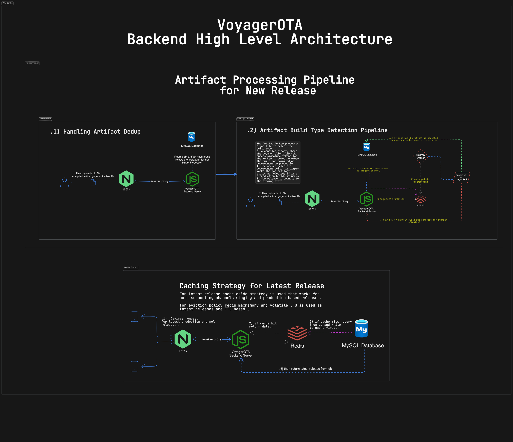

# VoyagerOTA

> a backend OTA platform for developers to manage monotonic semver firmware releases with binary inspection, staging, production channels, revocation, with an [OTA client SDK](https://github.com/mediocre9/VoyagerOTAClient).

## Features

- [x] Draft releases with versioning and changelogs
- [x] Prevent version collisions and duplicate binaries
- [x] Automatic build type validation
- [x] Staging channel for verified production builds
- [x] Manual promotion to production
- [x] Release revocation

## Planned Features

- [ ] Device update reporting

## Setup

> [!NOTE]
> Create a `.env.development` file in the root before running the server.

```env
npm install

# then run server in development mode....
npm run dev

# and then run artifact worker separately.....
npm run artifact-worker
```

## Authentication & Project Setup

1. Sign up.
2. Create a project.
3. Get `projectId` and `apiKey`.
4. Use the credentials in sdk.

## Client Side Device Integration

> [!TIP]
> Use the official client sdk library [**voyagerota-client-lib**](https://github.com/mediocre9/VoyagerOTAClient) to handle OTA updates on ESP32 devices.

```cpp
#define __ENABLE_DEVELOPMENT_MODE__ true
#define CURRENT_FIRMWARE_VERSION "1.0.0"

#include <VoyagerOTAClient.h>
#include <WiFi.h>
using namespace Voyager;

void connectToWifi() {
    WiFi.begin("SSID", "PASSWORD");
    while (WiFi.status() != WL_CONNECTED) {
        Serial.print(".");
        delay(50);
    }
    Serial.println("Connected to Internet");
}

void setup() {
    Serial.begin(9600);
    connectToWifi();
    OTA<HTTPResponseData, VoyagerReleaseModel> ota(CURRENT_FIRMWARE_VERSION);

    ota.setCredentials("voyager-project-id-here....", "voyager-api-key-here...");
    ota.setBaseURL("voyager-base-url.....");

    auto release = ota.fetchLatestRelease();

    if (release && ota.isNewVersion(release->version)) {
        Serial.println("New version available: " + release->version);
        Serial.println("Changelog: " + release->changeLog);
        ota.setDownloadURL(release->downloadURL);
        ota.performUpdate();
    } else {
        Serial.println("No updates available");
    }
}

void loop() {}
```

> [!NOTE]
>
> 1. The `__ENABLE_DEVELOPMENT_MODE__` must be declared at the top either as true or false. As this compile time flag is required only for VoyagerOTA platform.
> 2. Firmware uploaded to VoyagerOTA must be built with `__ENABLE_DEVELOPMENT_MODE__` false. Development compiled builds will be rejected by the VoyagerOTA platform.
> 3. The library uses staging and production channels. Production builds first go to the **staging** channel for testing.
> 4. On your local device, you can temporarily set `__ENABLE_DEVELOPMENT_MODE__` true to fetch the **staging** release.
> 5. After testing, promote the release to **production** to make it available to all devices.

## Architecture

### 1. Release Flow

Release Flow begins with drafting a release containing only metadata such as version and changelog. The system hashes the uploaded compiled binary and automatically rejects any duplicates. The background artifact worker inspects the binary to determine its build type. Only production enabled compiled binaries can move to the staging channel for testing, unknown or staging enabled binaries are rejected by the inspection worker. Verified production builds can then be manually promoted to production. Devices fetch updates from the relevant channel staging or production depending on their mode.

### 2. System High Level Architecture Diagram

<p align="center">
  
</p>

## License

This project is licensed under the MIT License. See the [LICENSE](https://github.com/mediocre9/voyager-ota/blob/main/LICENSE) for details.
